Trajectory inference
================
Qirong Mao

Acknowledgment: This tutorial of Dimensionality Reduction is based on
the Slingshot tutorial on Bioconductor
([Link](https://bioconductor.org/packages/devel/bioc/vignettes/slingshot/inst/doc/vignette.html))
and the single cell RNA-seq workshop from Broad Institute
([Link](https://broadinstitute.github.io/2020_scWorkshop/trajectory-analysis.html))

``` r
suppressPackageStartupMessages({
library(SingleCellExperiment)
library(Seurat)
library(ggbeeswarm)
library(ggthemes)
library(dplyr)
library(cowplot)
library(RColorBrewer)
library(scater)
library(scran)
library(tradeSeq)
library(slingshot)
})
```

## Data loading

We will use a nice SMART-Seq2 single cell RNA-seq data from Single-Cell
RNA-Seq Reveals Dynamic, Random Monoallelic Gene Expression in Mammalian
Cells. Here is one relevant detail from their paper: “To investigate
allele-specific gene expression at single-cell resolution, we isolated
269 individual cells dissociated from in vivo F1 embryos (CAST/EiJ ×
C57BL/6J, hereafter abbreviated as CAST and C57, respectively) from
oocyte to blastocyst stages of mouse preimplantation development (PD)”

``` r
mydir <- "/cloud/project/session-trajectories/data/"
path.deng <- paste0(mydir, "deng-reads.rds")
deng_SCE <- readRDS(path.deng)
```

``` r
table(deng_SCE$cell_type2)
```

    ## 
    ##     16cell      4cell      8cell early2cell earlyblast  late2cell  lateblast 
    ##         50         14         37          8         43         10         30 
    ##   mid2cell   midblast         zy 
    ##         12         60          4

## Principle Components Analysis

Let us take a first look at the Deng data. One simple approach to
ordering cells in pseudotime is to use PCA. By carrying out PCA and
labeling the cells by the stage at which they were collected, we can see
how well the principal components separate cells along a differentiation
trajectory.

``` r
##
deng_SCE$cell_type2 <- factor(deng_SCE$cell_type2,
                              levels = c("zy", "early2cell", "mid2cell", "late2cell", 
                                         "4cell", "8cell", "16cell", "earlyblast",
                                         "midblast", "lateblast"))
```

``` r
# Run PCA on Deng data. Use the runPCA function from the SingleCellExperiment package.
deng_SCE <- runPCA(deng_SCE, ncomponents = 50)

# Use the reducedDim function to access the PCA and store the results. 
pca <- reducedDim(deng_SCE, "PCA")

# Describe how the PCA is stored in a matrix. Why does it have this structure?
head(pca)
```

    ##                PC1       PC2        PC3         PC4        PC5         PC6
    ## 16cell   -24.79868 -62.20826  -8.035201 -2.07391816 -2.1297390 -14.0930954
    ## 16cell.1 -28.77121 -50.35974 -13.607012  0.08664449 -0.9454185  -3.5987880
    ## 16cell.2 -26.67901 -61.03875  -7.239352 -6.60967794  1.0775002 -11.8876579
    ## 16cell.3 -29.01151 -56.03620  -6.433057  2.85332708  4.2885083   0.1488504
    ## 16cell.4 -26.38026 -58.09265  -4.671850  7.99519397 -9.8077416  -2.0570042
    ## 16cell.5 -24.90566 -60.77897  -5.632497 -3.80156587 -9.8835527 -11.9028394
    ##                 PC7        PC8        PC9       PC10       PC11       PC12
    ## 16cell   -2.4645020  1.6350660  -7.202260  -9.862212 -10.660702  0.6401721
    ## 16cell.1 -2.1726663 -3.3481641  -8.967394  -6.664942 -14.493227 11.7471565
    ## 16cell.2  7.9007309  0.3368756  -6.032645  -5.295515 -15.384993  4.2930696
    ## 16cell.3  4.3727592 -1.1582470  -1.520145   8.789699 -19.386866 -0.4999047
    ## 16cell.4  0.6031572 -3.6743278  -5.793753 -10.823787  -7.613724  4.7288640
    ## 16cell.5  4.3269009  3.8968881 -11.805221  -9.798854 -11.016137 19.1535086
    ##               PC13      PC14      PC15       PC16       PC17       PC18
    ## 16cell   -5.716841  6.544614  6.652210  -3.458346  -4.499013 -11.360753
    ## 16cell.1 13.284708 -4.206404  8.721043  -7.926277  -0.703508  -5.418131
    ## 16cell.2  9.633173  1.672498  9.609001  -9.302794 -10.219743  -5.763834
    ## 16cell.3 14.177687 -8.509097  6.978210  10.771078  -6.188808   6.504081
    ## 16cell.4  3.106382 -4.078414 10.739979 -12.032452  -6.239499   2.331292
    ## 16cell.5  9.544362 -2.255400  8.614958  -2.832196  -1.798584   2.321082
    ##                 PC19      PC20       PC21       PC22       PC23      PC24
    ## 16cell     2.2617345 -2.456274 -11.227414 -1.7122827  -8.418641  4.254968
    ## 16cell.1 -11.8613891  4.069530  -9.320831 -0.5802347 -11.878096 -6.412425
    ## 16cell.2  -3.3460356  4.165813  -2.031473  2.1106373  -1.762218 -1.135134
    ## 16cell.3  -0.6042649  6.008176  -9.982856 -9.4888653   2.822138 12.871921
    ## 16cell.4   3.9402029 -0.298227 -10.773722  0.6374236   4.730329  4.670391
    ## 16cell.5  -2.0280791  5.050525   3.252243  7.1527175  -9.923140 -1.791511
    ##               PC25      PC26       PC27      PC28        PC29       PC30
    ## 16cell   -4.049629  4.133374 -0.6235391 -3.381254 13.94917609  -8.217824
    ## 16cell.1 -8.052083  8.334263 -0.5815629  4.592214  1.32417854   5.266909
    ## 16cell.2 -2.326133  3.775858 -2.3388745 -6.947394  0.08121559  -2.942813
    ## 16cell.3 -5.860750  1.869659  7.0402429  5.092207 -2.53575943 -18.529304
    ## 16cell.4 -4.291113 13.005331  3.2802102  4.606226 -3.52531994  -3.599833
    ## 16cell.5  4.708265  5.717693  1.1023767  9.761377 -4.57312078 -12.138646
    ##                PC31       PC32        PC33      PC34       PC35       PC36
    ## 16cell    -6.897320  -5.675943   8.6076039 -3.713348 -0.9099737  4.7467546
    ## 16cell.1  -4.538307   9.166969  -9.4525575 -8.848231 -2.0782319  7.4318993
    ## 16cell.2   3.082470  -2.207176   0.5365986 -3.895378  7.4493361  0.7465149
    ## 16cell.3   1.680117  -3.839556 -13.3156066 -6.257479 -4.1112596  0.2780589
    ## 16cell.4 -13.314741  -1.453554   0.1334034  2.941487 -0.8162660 -2.9940693
    ## 16cell.5  -4.608498 -12.180530   5.8667454  6.645273  1.0224859  0.8960299
    ##               PC37       PC38       PC39       PC40      PC41       PC42
    ## 16cell   -9.063470 -5.2765051  1.1758453  -9.474215  3.559391 -4.7781174
    ## 16cell.1 -6.217009  1.0216459  0.5798035 -21.705585 -3.570104  2.3279922
    ## 16cell.2 -6.227582  3.0863112  8.6153521   1.401230  2.266017  0.8150665
    ## 16cell.3 -8.411600  3.7169411 -0.7050601  -2.959623 -3.123082  1.0916370
    ## 16cell.4  2.871774 -4.2664023 -7.4894594   8.207422  4.223035 -1.4763578
    ## 16cell.5 10.169730  0.3923632 -9.3346900  -8.114487 11.186021 -4.5635674
    ##                PC43      PC44       PC45      PC46        PC47      PC48
    ## 16cell    7.9228097  8.558202  7.0589601 -3.058213   0.5723815  4.675859
    ## 16cell.1 -5.6006755 -8.717056 -6.4809594 -8.554812  13.1868751  3.397683
    ## 16cell.2 -5.2532880  5.803788  2.7268218 -1.241770  -7.4824426 -4.088268
    ## 16cell.3  0.0513553  2.181424  2.4047798 -8.691231  -8.9700019 -3.713547
    ## 16cell.4 -1.5501973 -4.946841  0.5207532  3.068228 -10.7801143  5.167618
    ## 16cell.5  9.9821175  8.759947 -3.7277578  9.064882   1.7524451 -3.306568
    ##               PC49       PC50
    ## 16cell   -2.937621  3.5882779
    ## 16cell.1 -3.419868 -3.4878920
    ## 16cell.2  4.445723 -0.2352798
    ## 16cell.3 -5.179552  9.7180911
    ## 16cell.4 -1.077760  3.0507728
    ## 16cell.5  5.018972  0.9282575

``` r
dim(pca)
```

    ## [1] 268  50

``` r
plotReducedDim(deng_SCE, dimred = "PCA",colour_by="cell_type2",ncomponents = (1:2))
```

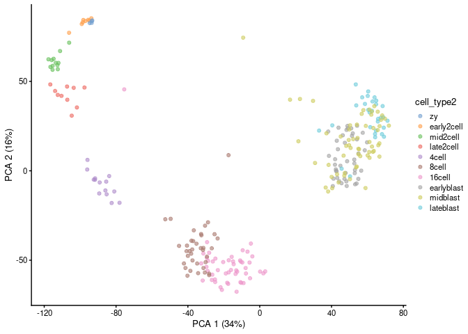<!-- -->

You could find PC1 and PC2 captured variances based on different
development stages, let’s take a further look:

``` r
# designed to capture differentiation processes. As a simple measure of pseudotime 
# we can use the coordinates of PC1.
# Plot PC1 vs cell_type2. 
deng_SCE$PC1 <- pca[,1]
deng_SCE$PC2 <- pca[,2]
deng_SCE$pseudotime_PC1 <- rank(deng_SCE$PC1)  # rank cells by their PC1 score
ggplot(as.data.frame(colData(deng_SCE)), aes(x = pseudotime_PC1, y = cell_type2, 
                                             colour = cell_type2)) +
    geom_quasirandom(groupOnX = FALSE) +
    scale_color_tableau() + theme_classic() +
    xlab("PC1") + ylab("Timepoint") +
    ggtitle("Cells ordered by first principal component")
```

    ## Orientation inferred to be along y-axis; override with
    ## `position_quasirandom(orientation = 'x')`

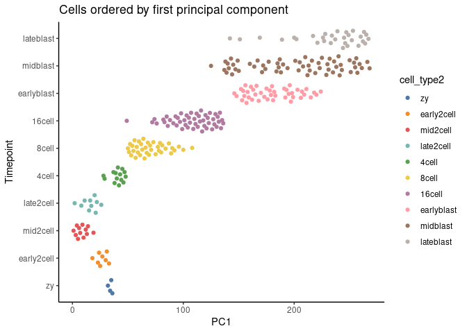<!-- -->

``` r
# Try separating the cell types using other PCs. How does the separation look?
plotReducedDim(deng_SCE, dimred = "PCA",colour_by="cell_type2",ncomponents = (2:3))
```

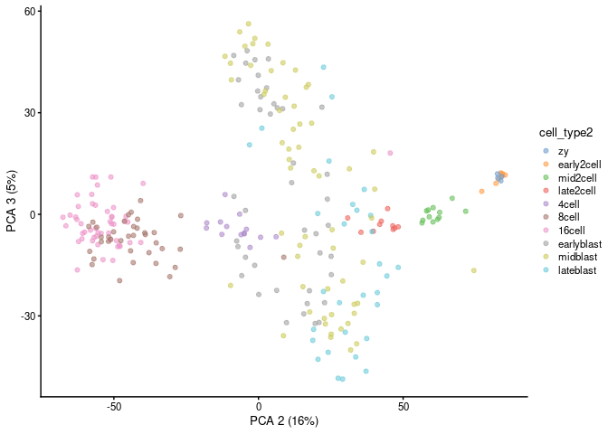<!-- -->

## Slingshot map pseudotime

Let us see how another advance trajectory inference method, Slingshot,
performs at placing cells along the expected differentiation trajectory.

``` r
sce <- slingshot(deng_SCE, reducedDim = 'PCA')  # no clusters provided
```

    ## No cluster labels provided. Continuing with one cluster.

``` r
# Plot PC1 vs PC2 colored by Slingshot pseudotime.
colors <- rainbow(50, alpha = 1)
plot(reducedDims(sce)$PCA, col = colors[cut(sce$slingPseudotime_1,breaks=50)], pch=16, asp = 1)
lines(SlingshotDataSet(sce), lwd=2)
```

<!-- -->
Let’s order cells based on the pseudotime from Slingshot:

``` r
slingshot_df <- data.frame(colData(sce)[, names(colData(sce)) != 'slingshot', drop=FALSE])

# Plot Slingshot pseudotime vs cell stage. 
ggplot(slingshot_df, aes(x = sce$slingPseudotime_1, y = cell_type2, 
                              colour = cell_type2)) +
    geom_quasirandom(groupOnX = FALSE) +
    scale_color_tableau() + theme_classic() +
    xlab("Slingshot pseudotime") + ylab("Timepoint") +
    ggtitle("Cells ordered by Slingshot pseudotime")
```

    ## Orientation inferred to be along y-axis; override with
    ## `position_quasirandom(orientation = 'x')`

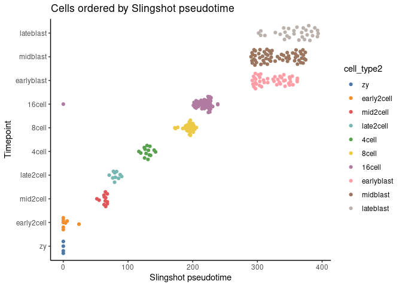<!-- -->

Next, we are gonna re-clustered the data and run Slingshot again to see
if they still align with the known cluster labels in the data.

``` r
# Cluster cells using the Seurat workflow below.
gcdata <- CreateSeuratObject(counts = counts(deng_SCE), project = "slingshot")
```

    ## Warning: Feature names cannot have pipe characters ('|'), replacing with dashes
    ## ('-')

``` r
gcdata <- NormalizeData(gcdata, normalization.method = "LogNormalize", scale.factor = 10000)
gcdata <- FindVariableFeatures(gcdata, selection.method = "vst", nfeatures = 2000)
gcdata <- ScaleData(object = gcdata, do.center = T, do.scale = F)
```

    ## Centering data matrix

``` r
gcdata <- RunPCA(gcdata, features = VariableFeatures(gcdata), npcs = 40, ndims.print = 1:5, nfeatures.print = 5)
```

    ## PC_ 1 
    ## Positive:  Actb, Fabp3, Psap, Akr1b8, Krt18 
    ## Negative:  Zbed3, C86187, Klf17, Btg4, Ccdc6 
    ## PC_ 2 
    ## Positive:  Krt18, Id2, Akr1b8, BC053393, Fabp3 
    ## Negative:  Gm11517, Alppl2, Obox6, Pdxk, Trim43b 
    ## PC_ 3 
    ## Positive:  Id2, Krt18, Tspan8, BC053393, Krt8 
    ## Negative:  Gm11517, Alppl2, Ypel5, Pdxk, Fam46c 
    ## PC_ 4 
    ## Positive:  Alppl2, Dab2, Gm11517, Krt18, Tspan8 
    ## Negative:  Upp1, Tdgf1, Spp1, Zfp57, Tat 
    ## PC_ 5 
    ## Positive:  Klf17, Ddx24, Bod1l, Tor1b, Gm1995 
    ## Negative:  Alppl2, Gm4340, Gm11756, Gm8300, Gm5039

``` r
# Cluster the cells using the first twenty principal components.
gcdata <- FindNeighbors(gcdata, reduction = "pca", dims = 1:20, k.param = 20)
```

    ## Computing nearest neighbor graph

    ## Computing SNN

``` r
gcdata <- FindClusters(gcdata, resolution = 0.8, algorithm = 1, random.seed = 100)
```

    ## Modularity Optimizer version 1.3.0 by Ludo Waltman and Nees Jan van Eck
    ## 
    ## Number of nodes: 268
    ## Number of edges: 6814
    ## 
    ## Running Louvain algorithm...
    ## Maximum modularity in 10 random starts: 0.7647
    ## Number of communities: 6
    ## Elapsed time: 0 seconds

``` r
# Add clustering information from Seurat to the deng_SCE object
colData(deng_SCE)$Seurat_clusters <- as.character(Idents(gcdata))
```

``` r
plotReducedDim(deng_SCE, dimred = "PCA",color_by="cell_type2",shape_by="Seurat_clusters",ncomponents = (1:2))
```

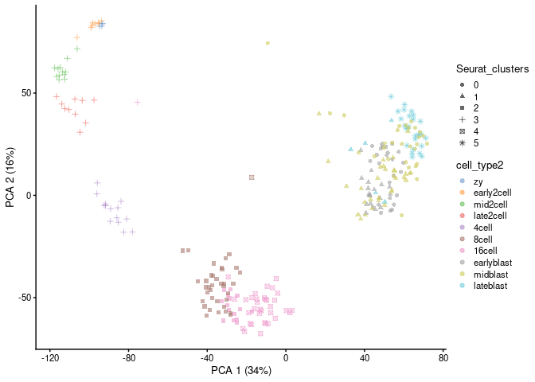<!-- -->

``` r
# Then run Slingshot using these cluster assignments.
sce2 <- slingshot(deng_SCE, clusterLabels = 'Seurat_clusters', reducedDim = 'PCA')

# Plot PC1 vs PC2 colored by Slingshot pseudotime.
colors <- rainbow(50, alpha = 1)
plot(reducedDims(sce2)$PCA, col = colors[cut(sce2$slingPseudotime_1,breaks=50)], pch=16, asp = 1)
lines(SlingshotDataSet(sce2), lwd=2, type = 'lineages', col = 'black')
```

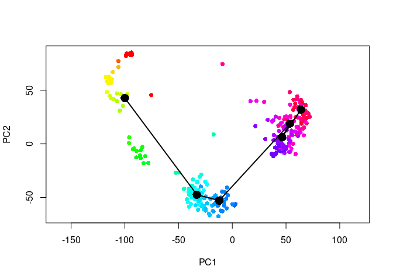<!-- -->

``` r
## Checking the linkage information
SlingshotDataSet(sce2)
```

    ## class: SlingshotDataSet 
    ## 
    ##  Samples Dimensions
    ##      268         50
    ## 
    ## lineages: 1 
    ## Lineage1: 3  2  4  0  1  5  
    ## 
    ## curves: 1 
    ## Curve1: Length: 392.79   Samples: 268

``` r
slingshot_df2 <- data.frame(colData(sce2)[, names(colData(sce2)) != 'slingshot', drop=FALSE])

slingshot_df2$Seurat_clusters <- factor(slingshot_df2$Seurat_clusters,
                              levels = c("3", "2", "4", "0", 
                                         "1", "5"))

# Plot Slingshot pseudotime vs cell stage. 
ggplot(slingshot_df2, aes(x = slingPseudotime_1, y = Seurat_clusters, 
                              colour = cell_type2)) +
    geom_quasirandom(groupOnX = FALSE) +
    scale_color_tableau() + theme_classic() +
    xlab("Slingshot pseudotime") + ylab("Timepoint") +
    ggtitle("Cells ordered by Slingshot pseudotime")
```

    ## Orientation inferred to be along y-axis; override with
    ## `position_quasirandom(orientation = 'x')`

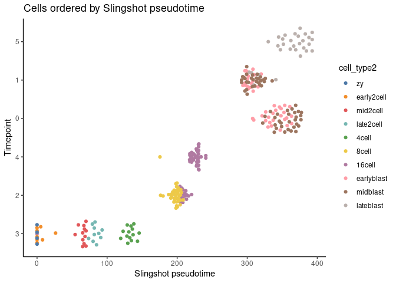<!-- -->

``` r
deng_SCE$cell_type2 <- factor(deng_SCE$cell_type2,
                              levels = c("zy", "early2cell", "mid2cell", "late2cell", 
                                         "4cell", "8cell", "16cell", "earlyblast",
                                         "midblast", "lateblast"))

slingshot_df2 <- data.frame(colData(sce2)[, names(colData(sce2)) != 'slingshot', drop=FALSE])

# Plot Slingshot pseudotime vs cell stage. 
ggplot(slingshot_df2, aes(x = slingPseudotime_1, y = cell_type2, 
                              colour = cell_type2)) +
    geom_quasirandom(groupOnX = FALSE) +
    scale_color_tableau() + theme_classic() +
    xlab("Slingshot pseudotime") + ylab("Timepoint") +
    ggtitle("Cells ordered by Slingshot pseudotime")
```

    ## Orientation inferred to be along y-axis; override with
    ## `position_quasirandom(orientation = 'x')`

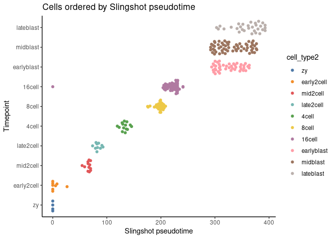<!-- -->

## Identifying temporally dynamic genes

After running slingshot, we are often interested in finding genes that
change their expression over the course of development. We will
demonstrate this type of analysis using the tradeSeq package ([Van den
Berge et al. 2020](https://www.nature.com/articles/s41467-020-14766-3)).

For each gene, we will fit a general additive model (GAM) using a
negative binomial noise distribution to model the (potentially
nonlinear) relationships between gene expression and pseudotime. We will
then test for significant associations between expression and pseudotime
using the associationTest.

Here, we are only chosing ~160 highly variable genes to run the GAM due
to the computational time. You should use all the genes during your
analysis.

``` r
## Selecting highly variable genes
hvg <- modelGeneVar(sce)
chosen <- getTopHVGs(hvg, prop=0.02)
sce <- sce[chosen,]

# fit negative binomial GAM
sce <- fitGAM(sce)

# test for dynamic expression
ATres <- associationTest(sce)
```

Next, we visualize these genes in a heatmap with the order of the
pseudotime:

``` r
topgenes <- rownames(ATres[order(ATres$pvalue), ])
pst.ord <- order(sce$slingPseudotime_1, na.last = NA)
heatdata <- assays(sce)$counts[topgenes, pst.ord]
heatclus <- sce$cell_type2[pst.ord]

heatmap(log1p(heatdata), Colv = NA,
        ColSideColors = brewer.pal(9,"Set1")[heatclus])
```

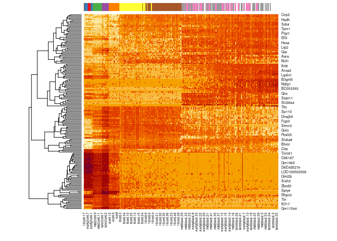<!-- -->

Based on the heatmap, you could find temporally dynamic genes across
diffrent development stage, let’s visualize some genes as example:

``` r
p1=plotExpression(deng_SCE, features = "Ccne1", x = "cell_type2",colour_by="cell_type2",exprs_values = "logcounts") + theme(axis.text.x = element_text(angle = 45, hjust = 1))
p2=plotReducedDim(deng_SCE, dimred = "PCA",color_by="Ccne1",ncomponents = (1:2))
p1+p2
```

<!-- -->

``` r
p1=plotExpression(deng_SCE, features = "Stac2", x = "cell_type2",colour_by="cell_type2",exprs_values = "logcounts") + theme(axis.text.x = element_text(angle = 45, hjust = 1))
p2=plotReducedDim(deng_SCE, dimred = "PCA",color_by="Stac2",ncomponents = (1:2))
p1+p2
```

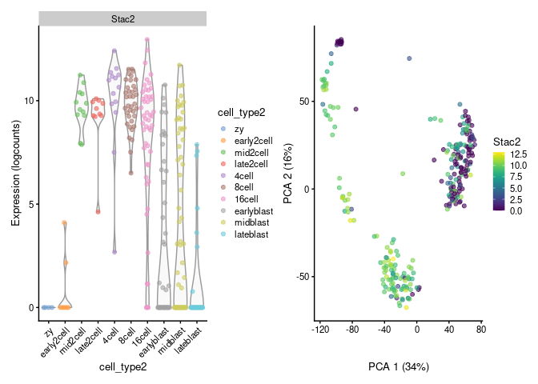<!-- -->

``` r
p1=plotExpression(deng_SCE, features = "Tmem180", x = "cell_type2",colour_by="cell_type2",exprs_values = "logcounts") + theme(axis.text.x = element_text(angle = 45, hjust = 1))
p2=plotReducedDim(deng_SCE, dimred = "PCA",color_by="Tmem180",ncomponents = (1:2))
p1+p2
```

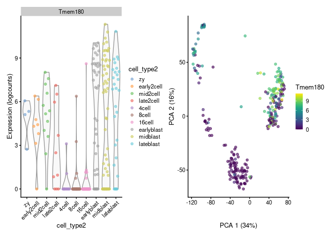<!-- -->
Here, we are using a simple dataset with only 268 cells, which is why we
only got one linkage in the dataset, if you want to explore larger
dataset with multiple linkages with Slingshot, please check
[here](https://nbisweden.github.io/workshop-scRNAseq/labs/trajectory/slingshot.html)

``` r
sessionInfo()
```

    ## R version 4.3.1 (2023-06-16)
    ## Platform: x86_64-pc-linux-gnu (64-bit)
    ## Running under: Ubuntu 20.04.6 LTS
    ## 
    ## Matrix products: default
    ## BLAS:   /usr/lib/x86_64-linux-gnu/atlas/libblas.so.3.10.3 
    ## LAPACK: /usr/lib/x86_64-linux-gnu/atlas/liblapack.so.3.10.3;  LAPACK version 3.9.0
    ## 
    ## locale:
    ##  [1] LC_CTYPE=C.UTF-8       LC_NUMERIC=C           LC_TIME=C.UTF-8       
    ##  [4] LC_COLLATE=C.UTF-8     LC_MONETARY=C.UTF-8    LC_MESSAGES=C.UTF-8   
    ##  [7] LC_PAPER=C.UTF-8       LC_NAME=C              LC_ADDRESS=C          
    ## [10] LC_TELEPHONE=C         LC_MEASUREMENT=C.UTF-8 LC_IDENTIFICATION=C   
    ## 
    ## time zone: UTC
    ## tzcode source: system (glibc)
    ## 
    ## attached base packages:
    ## [1] stats4    stats     graphics  grDevices utils     datasets  methods  
    ## [8] base     
    ## 
    ## other attached packages:
    ##  [1] slingshot_2.8.0             TrajectoryUtils_1.8.0      
    ##  [3] princurve_2.1.6             tradeSeq_1.14.0            
    ##  [5] scran_1.28.2                scater_1.28.0              
    ##  [7] scuttle_1.10.2              RColorBrewer_1.1-3         
    ##  [9] cowplot_1.1.1               dplyr_1.1.3                
    ## [11] ggthemes_4.2.4              ggbeeswarm_0.7.2           
    ## [13] ggplot2_3.4.3               SeuratObject_4.1.4         
    ## [15] Seurat_4.4.0                SingleCellExperiment_1.22.0
    ## [17] SummarizedExperiment_1.30.2 Biobase_2.60.0             
    ## [19] GenomicRanges_1.52.0        GenomeInfoDb_1.36.4        
    ## [21] IRanges_2.34.1              S4Vectors_0.38.2           
    ## [23] BiocGenerics_0.46.0         MatrixGenerics_1.12.3      
    ## [25] matrixStats_1.0.0          
    ## 
    ## loaded via a namespace (and not attached):
    ##   [1] RcppAnnoy_0.0.21          splines_4.3.1            
    ##   [3] later_1.3.1               bitops_1.0-7             
    ##   [5] tibble_3.2.1              polyclip_1.10-6          
    ##   [7] lifecycle_1.0.3           edgeR_3.42.4             
    ##   [9] globals_0.16.2            lattice_0.21-8           
    ##  [11] MASS_7.3-60               magrittr_2.0.3           
    ##  [13] limma_3.56.2              plotly_4.10.2            
    ##  [15] rmarkdown_2.25            yaml_2.3.7               
    ##  [17] metapod_1.8.0             httpuv_1.6.11            
    ##  [19] sctransform_0.4.0         sp_2.0-0                 
    ##  [21] spatstat.sparse_3.0-2     reticulate_1.32.0        
    ##  [23] pbapply_1.7-2             abind_1.4-5              
    ##  [25] zlibbioc_1.46.0           Rtsne_0.16               
    ##  [27] purrr_1.0.2               RCurl_1.98-1.12          
    ##  [29] GenomeInfoDbData_1.2.10   ggrepel_0.9.3            
    ##  [31] irlba_2.3.5.1             listenv_0.9.0            
    ##  [33] spatstat.utils_3.0-3      goftest_1.2-3            
    ##  [35] spatstat.random_3.1-6     dqrng_0.3.1              
    ##  [37] fitdistrplus_1.1-11       parallelly_1.36.0        
    ##  [39] DelayedMatrixStats_1.22.6 leiden_0.4.3             
    ##  [41] codetools_0.2-19          DelayedArray_0.26.7      
    ##  [43] tidyselect_1.2.0          farver_2.1.1             
    ##  [45] ScaledMatrix_1.8.1        viridis_0.6.4            
    ##  [47] spatstat.explore_3.2-3    jsonlite_1.8.7           
    ##  [49] BiocNeighbors_1.18.0      ellipsis_0.3.2           
    ##  [51] progressr_0.14.0          ggridges_0.5.4           
    ##  [53] survival_3.5-5            tools_4.3.1              
    ##  [55] ica_1.0-3                 Rcpp_1.0.11              
    ##  [57] glue_1.6.2                gridExtra_2.3            
    ##  [59] xfun_0.40                 mgcv_1.8-42              
    ##  [61] withr_2.5.1               fastmap_1.1.1            
    ##  [63] bluster_1.10.0            fansi_1.0.4              
    ##  [65] digest_0.6.33             rsvd_1.0.5               
    ##  [67] R6_2.5.1                  mime_0.12                
    ##  [69] colorspace_2.1-0          scattermore_1.2          
    ##  [71] tensor_1.5                spatstat.data_3.0-1      
    ##  [73] utf8_1.2.3                tidyr_1.3.0              
    ##  [75] generics_0.1.3            data.table_1.14.8        
    ##  [77] httr_1.4.7                htmlwidgets_1.6.2        
    ##  [79] S4Arrays_1.0.6            uwot_0.1.16              
    ##  [81] pkgconfig_2.0.3           gtable_0.3.4             
    ##  [83] lmtest_0.9-40             XVector_0.40.0           
    ##  [85] htmltools_0.5.6           scales_1.2.1             
    ##  [87] png_0.1-8                 knitr_1.44               
    ##  [89] rstudioapi_0.15.0         reshape2_1.4.4           
    ##  [91] nlme_3.1-162              zoo_1.8-12               
    ##  [93] stringr_1.5.0             KernSmooth_2.23-21       
    ##  [95] parallel_4.3.1            miniUI_0.1.1.1           
    ##  [97] vipor_0.4.5               pillar_1.9.0             
    ##  [99] grid_4.3.1                vctrs_0.6.3              
    ## [101] RANN_2.6.1                promises_1.2.1           
    ## [103] BiocSingular_1.16.0       beachmat_2.16.0          
    ## [105] xtable_1.8-4              cluster_2.1.4            
    ## [107] beeswarm_0.4.0            evaluate_0.21            
    ## [109] cli_3.6.1                 locfit_1.5-9.8           
    ## [111] compiler_4.3.1            rlang_1.1.1              
    ## [113] crayon_1.5.2              future.apply_1.11.0      
    ## [115] labeling_0.4.3            plyr_1.8.8               
    ## [117] stringi_1.7.12            viridisLite_0.4.2        
    ## [119] deldir_1.0-9              BiocParallel_1.34.2      
    ## [121] munsell_0.5.0             lazyeval_0.2.2           
    ## [123] spatstat.geom_3.2-5       Matrix_1.6-1.1           
    ## [125] patchwork_1.1.3           sparseMatrixStats_1.12.2 
    ## [127] future_1.33.0             statmod_1.5.0            
    ## [129] shiny_1.7.5               ROCR_1.0-11              
    ## [131] igraph_1.5.1
